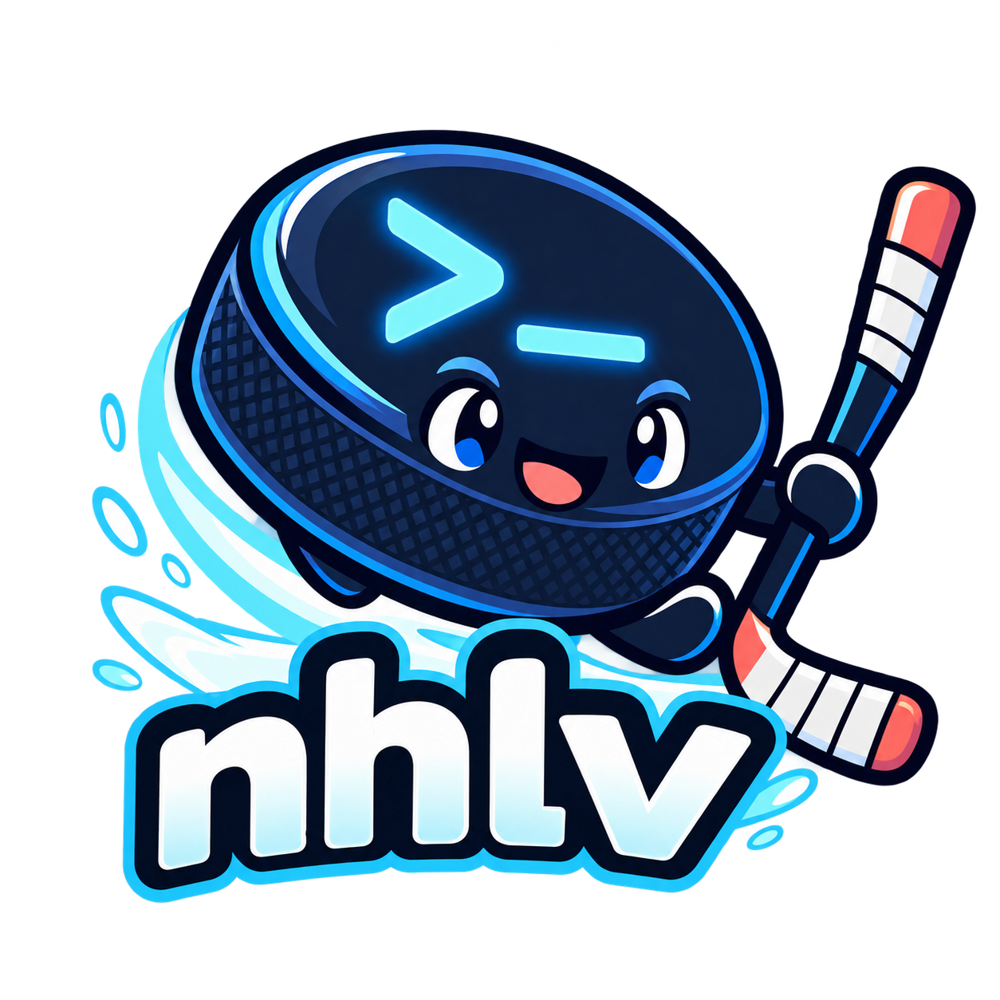
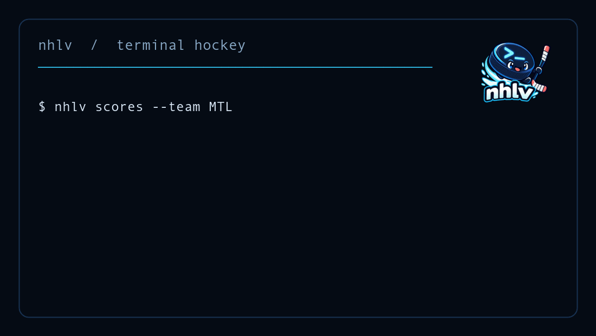

# nhlv





`nhlv` is a small command-line client for NHL scores, standings, and schedules.
It uses the public NHL web API and does not require an account or subscription.

## Install

With `pipx`:

```bash
pipx install git+https://github.com/totuta/nhlv.git
```

With a virtual environment:

```bash
python3 -m venv .venv
source .venv/bin/activate
python -m pip install .
```

## Usage

```bash
nhlv                         # today's scores
nhlv scores --team TOR       # today's Toronto games
nhlv standings               # current standings
nhlv standings wildcard      # Eastern and Western wild card race
nhlv standings --group East  # filter by conference/division name
nhlv schedule                # upcoming schedule
nhlv schedule --team MTL    # upcoming Montreal schedule
nhlv team TOR                # Toronto season schedule
nhlv leaders                 # current skater points leaders
nhlv leaders goalies         # current goalie wins leaders
nhlv leaders skaters --category goals --limit 20
nhlv boxscore 2026020040     # boxscore for a game ID
nhlv boxscore --team TOR     # today's boxscore for a team
nhlv boxscore --favorites    # today's boxscores for favourite teams
nhlv favorite-stats          # today's stats for favourite players
nhlv scores --date 2026-10-05
```

The default output is plain text so it works well in a terminal, `less`,
scripts, and SSH sessions.

## Favourite teams

Favourite teams are highlighted in scores, standings, and boxscores. The
primary configuration file is `~/.config/nhlv/config`:

```ini
favs=OTT,TOR
favorite_players=hutson
```

The older `~/.config/mlbv/config` `favs=` setting is used only as a fallback
when the NHL-specific setting is absent. You can also set:

```bash
export NHLV_FAVORITES=TOR,MTL
```

The environment variable takes precedence over both config files.
Favorite players use last names and can also be set with:

```bash
export NHLV_FAVORITE_PLAYERS=hutson,mcdavid
```

## Updating

For a `pipx` installation from GitHub:

```bash
pipx upgrade nhlv
```

For a source checkout:

```bash
cd ~/Desktop/Research/MISC/nhlv
git pull
python3 -m pip install -e .
```

## Development

```bash
python -m pip install -e '.[dev]'
pytest
```

The project is independent of `mlbv`; it only shares the same general goal of
providing a lightweight terminal sports client.

## Data source

Data is retrieved from NHL's public web endpoints under
`https://api-web.nhle.com/v1`. The endpoints are not an official stable SDK
contract, so API changes may require updates to this project.

## License

MIT
